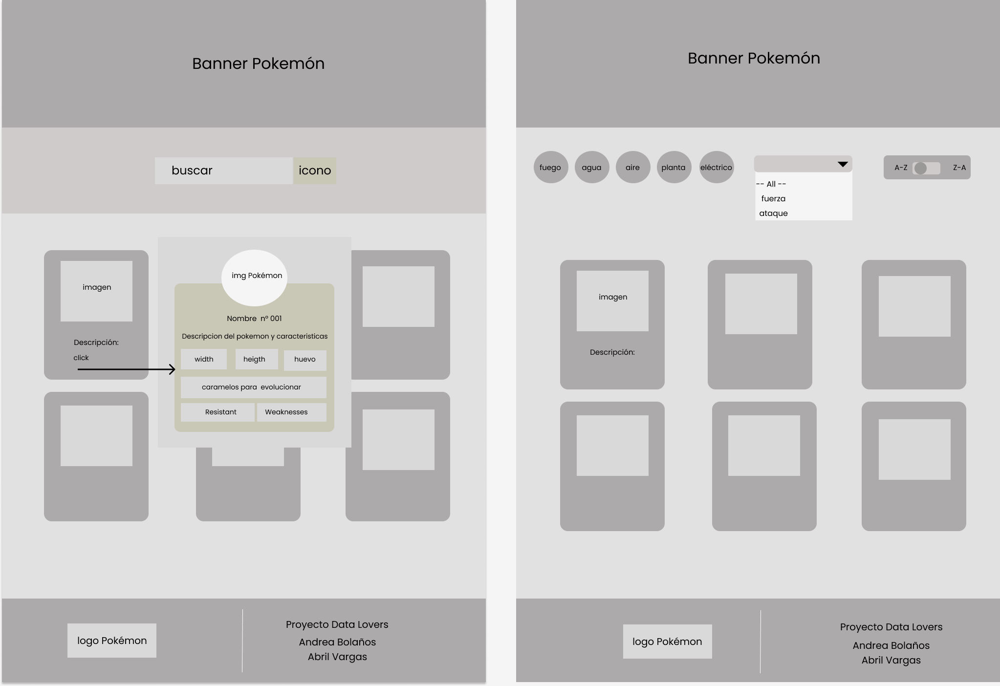
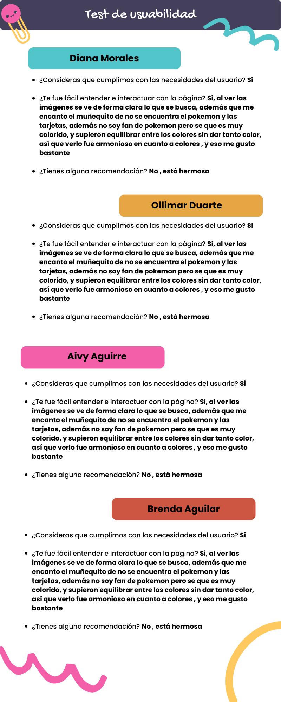
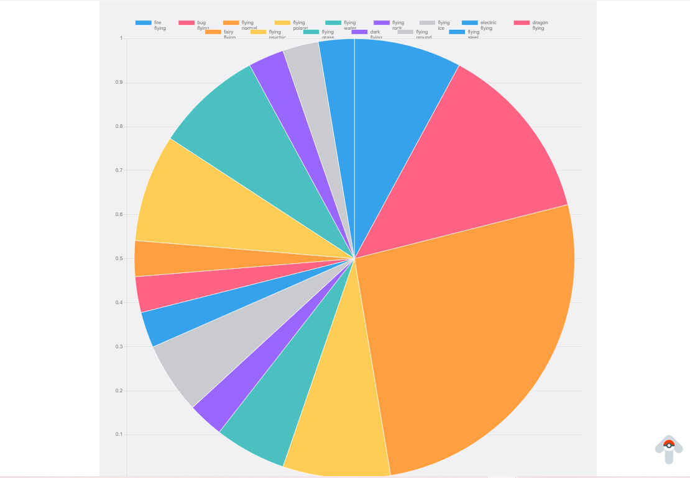

# Data Lovers


***

## 1. Definición del producto

De acuerdo con las temáticas asignadas, la dupla DL11 decidió escoger el tema de Pokemón GO. La filtración de la data se realizará de acuerdo a las Historia de Usuario para visualizar, filtrar, ordenar y hacer algún cálculo agregado.

## 2. Objetivo del proyecto

Crear una aplicación web que permita al usuario filtrar la data de los 251 pokemones que visualiza el tipo, fuerza y evolución, así podrán elegir a que pokemón atrapar de acuerdo a las estadísticas que se muestra e ir ampliando tu catálogo en el Pokédex, obtendrás una mejor perspectiva como entrenador pokemón.

## 3. Historia de Usuario

Reflexiona y luego marca los objetivos que has llegado a entender y aplicar en tu proyecto. Piensa en eso al decidir tu estrategia de trabajo.

### Historia 1


1. Como nuevo usuario de Pokémon Go, quiero poder tener una aplicación/ página donde pueda ver la información relevante sobre los pokémons, para conocerlos más.
* Criterios de aceptación. (Necesidad del usuario)
Visualización en página WEB de la base de datos de pokemones.
* Definición de terminado  (Lo que el desarrollador hace para cumplir las necesidades).          
 Página WEB estructurada.
Tarjetas Pokémon agregadas con sus características.
Responsive.
Diseño CSS.
Filtro por número en la Pokédex (JS).
Orden ascendente descendente.
Test Filtro.


### Historia 2

2. Yo como usuaria de Pokémon Go,quiero poder seleccionar los pokemones de acuerdo a la clasificación por elemento para ver si son de agua,aire,fuego,etc.
* Criterios de aceptación.
Página WEB con filtros por elementos
       
* Definición de hecho
Página WEB funcional.
Tarjetas Pokémon filtradas por sus elementos.
Responsive.
Mejora contínua CSS.
Orden ascendente y descendente.
Test Filtro.

### Historia 3

3. Yo como aficionado a Pokémon Go, quiero saber el tipo de debilidad y fortaleza de mis pokemones, para saber la forma de organizar mis equipos a la hora de ir a batalla o a una incursión.
* Criterios de aceptación
Página WEB actualizada con filtros por debilidades y fortalezas de los Pokemones.
* Definición de hecho.
Página WEB funcional.
Responsive.
Filtros por Fortalezas y debilidades.
Mejora Contínua CSS.
Orden Ascendente y descendentes.
Test Filtro.


### Historia 4

4. Yo como jugadora de Pokémon Go, quiero saber cuántos caramelos son necesarios para evolucionar a mis pokemones, para llevar un control de cómo los voy a ganar y a usar.
* Criterios de aceptación.
Página WEB actualizada con filtros por necesidad de caramelos para evolucionar.
* Definición de hecho.
Página WEB final con filtros funcionales y testeados.
Responsive.
Filtros por números de caramelos.
Mejora Contínua CSS.
Orden Ascendente y descendente
Test Filtro.

### Diseño de la Interfaz de Usuario

#### Prototipo de baja fidelidad

* De acuerdo a las historia de usuario se desea mostrar la data del pokemon por un filtrado del "nombre del pokemon" y a su vez ordenar dicha data de forma ascendente(A-Z) y descendente(Z-A). Y al dar click a la tajeta se muestre un popup que describa mas a detalle al pokemon,asi como hacer otro filtrado por fuerza y resistenci.



#### Prototipo de alta fidelidad


diseño visual. Nosotros te recomendamos [Figma](https://www.figma.com/file/KiObrzfSpUtbpfMWTSI56t/Pokemon-ALta?type=design&node-id=0-1&mode=design&t=48F7ZpayV3imgWYD-0)


#### Testeos de usabilidad
* Preguntas que se realizaron a un grupo de usuarias para el Feedback de los prototipos.
1. ¿Consideras que cumplimos con las necesidades del usuario? (En caso de no cumplir) 
2. ¿Te fue fácil entender e interactuar con la página?
3. ¿Tienes alguna recomendación?

## Resultados



## Hacker edition
* Para el Hacker edition utilizamos la data que se habia filtrado en los tipos de pokemon, para graficar los valos por tipo ya sean convinados o uno solo. 
* La herramienta a utilizar fue la etiqueta canvas de HTML 5
```html
   <canvas id="myChart"></canvas>
```

* [Chart.js](https://www.chartjs.org/)
* Grafica por tipo de pokemon, de acuerdo al porcentaje del total de los pokemones existentes.
```js
   const arrayOfTypes = ["grass", "poison", 
   "normal", "water", "electric",
   "fighting", "fairy", "ice", "flying", 
    "psychic", "fire", "steel", "bug", 
    "rock", "dragon", "dark", "ground", "ghost"];
```


Resultados de tipo de pokemon en la grafica constrida con la data filtrada.

## Consideraciones técnicas

Utilizamos la data del pokemon.js

```js
    import data from './data/pokemon/pokemon.js';
```
* La data se almaceno en una variable para ser reutilizado en los demas filtrados.
```js
     const allName = data.pokemon; // data pokemon
```
## Pruebas Unitarias -Test 
* Al corregir la variable usada en el expected, salió el siguiente error (ver img), como la función getPokemonUnique ordena el contenido de los arreglos para homogeneizarlos en caso de que tengan los mismos tipos pero en diferente orden, la solución fue cambiar el orden de un arreglo en el argumento entregado al toEqual ['water', 'psychic'] a ['psychic', 'water']


## Checklist para solicitar PF

*  Usa VanillaJS.
* ![\[ \]](src/img/check.png) Pasa linter (`npm run pretest`)
* ![\[ \] ](src/img/check.png)Pasa tests (`npm test`)
* ![\[ \]](src/img/check.png) Pruebas unitarias cubren un mínimo del 70% de statements, functions y
  lines y branches.
* ![\[ \]](src/img/check.png) Incluye _Definición del producto_ clara e informativa en `README.md`.
* ![\[ \]](src/img/check.png) Incluye historias de usuario en `README.md`.
* ![\[ \]](src/img/check.png) Incluye _sketch_ de la solución (prototipo de baja fidelidad) en
  `README.md`.
* ![\[ \] ](src/img/check.png)Incluye _Diseño de la Interfaz de Usuario_ (prototipo de alta fidelidad)
  en `README.md`.
* ![ \[ \] ](src/img/check.png) Incluye link a Figma Dinámico para el test de usabilidad en `README.md`.
* ![ \[ \] ](src/img/check.png) Incluye el listado de problemas que detectaste a través de tests de
  usabilidad en el `README.md`.
* ![\[ \]](src/img/check.png) UI: Muestra lista y/o tabla con datos y/o indicadores.
* ![\[ \]](src/img/check.png) UI: Permite ordenar data por uno o más campos (asc y desc).
* ![ \[ \] ](src/img/check.png)UI: Permite filtrar data en base a una condición.
* ![ \[ \] ](src/img/check.png)UI: Es _responsive_.

Recuerda que también debes hacer: llenado de sprint check out de cierre de proyecto, una autoevaluación de objetivos de aprendizaje y autoevaluación de life skills desde tu dashboard de estudiante. [Acá el link](https://coda.io/d/_deHfHkTC743/Como-lograras-aprender-DEV_sumg1#_lu6qL) del flujo para que puedas ver el proceso.

Si no has completado todo lo anterior, no consideramos que estás lista para tu sesión de Project Feedback. ([acá](https://coda.io/d/_deHfHkTC743/Project-Feedback_suLH5) te dejamos el link de esta instancia)
