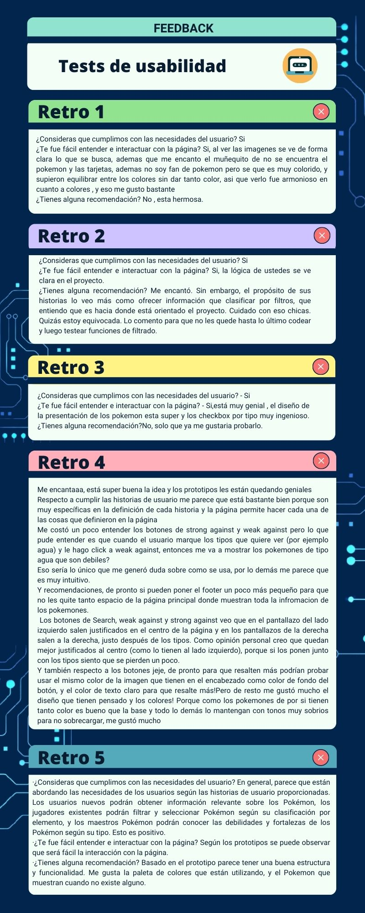
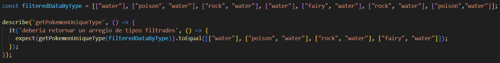

# Data Lovers


***

## 1. Definición del producto

De acuerdo con las temáticas asignadas, la dupla DL11 decidió escoger el tema de Pokemón GO. De acuerdo a las historias de usuario se realizará una página que nos permita visualizar, filtrar, ordenar y hacer algún cálculo agregado con la información existente en una base de datos.

## 2. Objetivo del proyecto

Crear una aplicación web que permita al usuario tener acceso a información relevante sobre los 251 pokemones como tipo, fuerza, evoluciones, qué pokemones son débiles contra determinado tipo, etc., así podrán elegir que pokemón atrapar o utilizar en batalla de acuerdo a las estadísticas que se muestran, obtendrás una mejor perspectiva como entrenador pokemón.

## 3. Historia de Usuario

Una historia de usuario es una explicación general e informal de una función de software escrita desde la perspectiva del usuario final o cliente.

El propósito de una historia de usuario es articular cómo un elemento de trabajo entregará un valor particular al cliente. 

Las historias de usuario son unas pocas frases en lenguaje sencillo que describen el resultado deseado. No entran en detalles, ya que los requisitos se añaden más tarde, una vez acordados por el equipo.

### Historia 1


Como nuevo usuario de Pokémon Go, quiero tener una aplicación/ página donde pueda ver la información relevante sobre los pokemones, para conocerlos más.

 #### Criterios de aceptación. (Necesidad del usuario)
* Visualización en página WEB de la base de datos de pokemones.
 #### Definición de terminado  (Lo que el desarrollador hace para cumplir las necesidades).          
* Página WEB estructurada.
* Tarjetas Pokémon agregadas con sus características.
* Responsive.
* Diseño CSS.
* Filtro por nombre (JS).
* Orden ascendente descendente por letra de inicio del nombre.
* Test Filtro.


### Historia 2

Yo como usuaria de Pokémon Go, quiero poder acceder a una lista de pokemones de acuerdo a su clasificación por tipo agua,aire,fuego,etc, para saber qué pokemones me hacen falta atrapar y así tener completas las colecciones de mis tipos favoritos.
#### Criterios de aceptación.
* Página con filtros por elementos.
       
#### Definición de hecho
* Página que permita seleccionar uno o más tipos.
* Tarjetas Pokémon filtradas por sus elementos.
* Mejora contínua CSS.
* Test Filtro.

### Historia 3

Yo como maestro Pokémon, quiero saber qué pokemones son débiles o resistentes contra un determinado tipo seleccionado, para saber la forma de organizar mis equipos a la hora de ir a batalla o a una incursión.
#### Criterios de aceptación
* Página WEB actualizada con filtros por debilidades y fortalezas de los Pokemones.
#### Definición de hecho.
* Página muestre qué pokemones son débiles o resistentes contra el tipo seleccionado.
* Mejora Contínua CSS.
* Test Filtro.


### Historia 4

Yo como coleccionador de pokemones, quiero tener información detallada sobre qué evoluciones me hacen falta y cuántos caramelos son necesarios, para llevar un control de cómo los voy a ganar y a usar .
#### Criterios de aceptación.
* Página con tarjetas más informativas sobre cada pokémon, que muestre las evoluciones y los caramelos necesarios.
#### Definición de hecho.
* Página con despliegue de tarjetas modales (al tener más información es mejor que se desplieguen individualmente para que no se vea tan cargado).
* Al hacer click en cada tarjeta de la lista, se despliega una tarjeta individual con información detallada de cada pokémon.
* Diseño responsive de las tarjetas modales.
* Mejora Contínua CSS.

## Diseño de la Interfaz de Usuario

### Prototipo de baja fidelidad
* De acuerdo con las historias de usuario se realizó un despliegue de información mediante tarjetitas que al darles click se abre un pop up que muestra detalladamente las características de cada pokemon. Estas tarjetas pueden ser ordenadas de forma ascendente y desdendente de la A-Z y de la Z-A. También se incluye un filtro que mediante un checkbox y botones, nos presentaran la información por tipo.


### Prototipo de alta fidelidad

Acceso al prototipo de alta fidelidad en [Figma](https://www.figma.com/community/file/1262833218909834245).


#### Testeos de usabilidad
* Después de presentar los prototipos a 6 usuarias se les realizaron las siguientes preguntas.
1. ¿Consideras que cumplimos con las necesidades del usuario? En caso de no cumplir ¿Qué crees que hace falta?
2. ¿Te fue fácil entender e interactuar con la página?
3. ¿Tienes alguna recomendación?


## Resultados



## Hacker edition
* Para el Hacker edition reutilizamos el checkbox donde podemos filtrar la data por tipo de pokemon, y con ello sacamos un cálculo agregado que nos permitiera hacer una gráfica.
* Utilizamos una librería de [Chart.js](https://www.chartjs.org/)
* La herramienta a utilizar fue la etiqueta canvas de HTML 5

#### Valor agregado
* Gráfica por porcentajes de tipos combinados dentro de una selección. Al seleccionar un tipo de pokemon en nuestro checklist y clickear en el boton "value added" se ejecuta un filtro que crea un arreglo con las combinaciones existentes, descarta los repetidos independientemente del orden, posteriormente hace el conteo de cuantos pokemones coinciden con cada tipo del arreglo y posteriormente saca un porcentaje. Por ejemplo si damos click en el checkbox de pokémon de tipo flying y luego al boton de "value added" nos mostrará una gráfica con los porcentajes de acuerdo a las combinaciones existentes, esto para saber que combinaciones son más frecuentes dentro de un tipo.
```js
//arreglo con las combinaciones encontradas
   const filteredUnique = [['fire', 'flying'], ['bug', 'flying'], ['flying', 'normal'], ['flying', 'poison'], ['flying', 'water'], ['flying', 'rock'], ['flying', 'ice'], ['electric', 'flying'], ['dragon', 'flying'], ['fairy', 'flying'], ['flying', 'psychic'], ['flying', 'grass'], ['dark', 'flying'], ['flying', 'ground'],['flying', 'steel']];
```


Resultados de tipo de pokemon en la grafica constrida con la data filtrada.

## Consideraciones técnicas

Utilizamos la data del pokemon.js

```js
    import data from './data/pokemon/pokemon.js';
```
La data se almaceno en una variable para ser reutilizado en los demas filtros.
```js
     const allName = data.pokemon; // data pokemon
```
## Pruebas Unitarias -Test 
Las pruebas unitarias son pruebas que evalúan el comportamiento individual y aislado de una pieza pequeña de código. El objetivo principal de las pruebas unitarias es verificar que la unidad funcione correctamente sin tener en cuenta el entorno.

Al desarrollar un test para la función de getPokemonUniqueType nos fueron saliendo varios errores a medida que los íbamos corrigiendo. Por ejemplo en la primera versión de este test, se detenía en la función sort que es la que ordena los arreglos para homogeneizarlos.



La solución fue cambiar la variable usada en expected, por que por la estructura de esta, el test no estaba entrando correctamente y no estaba ordenando el arreglo.


Al corregir la variable usada en el expected, salió el siguiente error (ver img), como la función getPokemonUnique ordena el contenido de los arreglos para homogeneizarlos en caso de que tengan los mismos tipos pero en diferente orden. La solución fue cambiar el orden de un arreglo en el argumento entregado al toEqual ['water', 'psychic'] a ['psychic', 'water']


## Checklist para solicitar PF

*  Usa VanillaJS.
* ![\[ \]](src/img/check.png) Pasa linter (`npm run pretest`)
* ![\[ \] ](src/img/check.png)Pasa tests (`npm test`)
* ![\[ \]](src/img/check.png) Pruebas unitarias cubren un mínimo del 70% de statements, functions y
  lines y branches.
* ![\[ \]](src/img/check.png) Incluye _Definición del producto_ clara e informativa en `README.md`.
* ![\[ \]](src/img/check.png) Incluye historias de usuario en `README.md`.
* ![\[ \]](src/img/check.png) Incluye _sketch_ de la solución (prototipo de baja fidelidad) en
  `README.md`.
* ![\[ \] ](src/img/check.png)Incluye _Diseño de la Interfaz de Usuario_ (prototipo de alta fidelidad)
  en `README.md`.
* ![ \[ \] ](src/img/check.png) Incluye link a Figma Dinámico para el test de usabilidad en `README.md`.
* ![ \[ \] ](src/img/check.png) Incluye el listado de problemas que detectaste a través de tests de
  usabilidad en el `README.md`.
* ![\[ \]](src/img/check.png) UI: Muestra lista y/o tabla con datos y/o indicadores.
* ![\[ \]](src/img/check.png) UI: Permite ordenar data por uno o más campos (asc y desc).
* ![ \[ \] ](src/img/check.png)UI: Permite filtrar data en base a una condición.
* ![ \[ \] ](src/img/check.png)UI: Es _responsive_.

